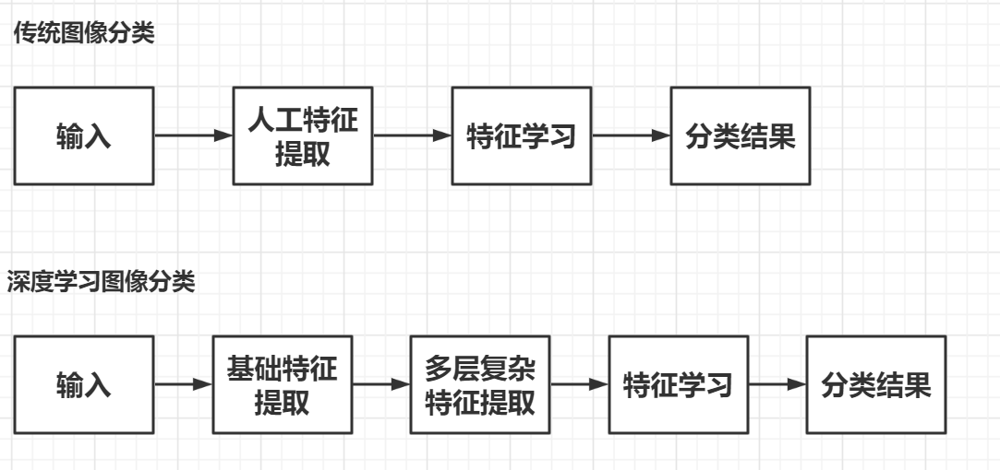

# 基于神经网络的垃圾分类识别系统软件设计

**完成人：沈方毅、郑娇**

## 1. 概述

### 1.1. 系统简介

​		本系统是借助现在的神经网络，来对垃圾进行识别和分类。经过一些处理，进入一个深度学习的模型，主要使用了残差网络ResNet50算法，通过python开发工具实现一个垃圾分类系统。

​	   该系统主要的功能是可以通过图像文件的检测与识别，可以检测出垃圾分类的结果，通过界面可视化，最终在GUI界面上进行垃圾分类识别系统的构建。

​	   通过pil对有问题的图片进行删除，并且贴图到合适的大小。通过torch进行图片的训练，使 用torchvision 的 ResNet50 模型，并且采用 ResNet50 的预训练模型。算法采用交叉熵损失函数，优化器选择 Adam，并采用 StepLR 进行学习率衰减。保存模型的策略是选择在验证集准确率最高的模型。通过测试集进行训练。

### 1.2. 目标读者

程序编写人员、程序审核人员以及有一定的神经网络学习理论知识基础，图像处理相关知识基础的读者

### 1.3. 书写约定

1、文档书写过程中，*斜体字*  表示专有名词

2、**加粗黑体字**表示重点内容

2、对于代码会用代码框

```python
代码框
```

4、对于长的专业名词进行了缩写，例如：ResNet50->ResNet、Tkinter->TK

##  2. 总体设计

​	传统分类图像的方法主要通过图像自身特性进行分类，实质是对图像分类基于特征的学习，其中重要的一步是**特征提取**。在此阶段，运用手动设计的算法对图像的特定部分编码，比如形状、色彩、材质，用这些特征来评定图像内容。根据这些特征，进而用于训练网络及评估网络。传统图像分类与深度学习图像分类的对比如下图所示



​	基于以上分析，对此系统进行了总体设计，将系统分为两部分，第一部分**图像预处理模块**，第二部分为**建立卷积神经网络模型模块**。


### 2.1. 图像预处理模块


1.通过高斯核进行滤波，去除噪声点，使图像平滑。

2.通过求取偏导，使用梯度强度和方向来提取边缘轮廓。

3.采用非极大值抑制方法，将提取到的粗犷的边缘轮廓细化。

4.采用双阈值来进一步过滤噪声即过滤掉不想要的线条，同时保证轮廓的连续性。

### 2.2. 建立卷积神经网络模型模块


## 3. 详细设计

### 3.1. 图像处理接口详细设计

#### 3.1.1.高斯滤波平滑处理函数


##### 1、原型：

```python
def smooth(image, sigma=1.1, length=5):
```

##### 2、功能

​	高斯滤波器是将高斯函数离散化，将滤波器中对应的横纵坐标索引代入到高斯函数，从而得到对应的值。然后用高斯滤波器对输入图像进行平滑处理。

##### 3、参数

```
image:灰度图像阵列
sigma:高斯滤波器的σ，默认为1.4
length:内核长度，默认为5
```

##### 4、返回值

```
平滑图像
```

#### 3.1.2.Sobel算子函数

##### 

##### 1、原型：

```python
def get_gradient_and_direction(image):
```

##### 2、功能

​	寻找边缘，即灰度强度变化最强的位置，（一道黑边一道白边中间就是边缘，它的灰度值变化是最大的）。在图像中，用梯度来表示灰度值的变化程度和方向。

##### 3、参数

```
image:灰度图像阵列
```

##### 4、返回值

```
梯度:每个像素的梯度
方向:每个像素的梯度方向
```

#### 3.1.3.非极大值抑制函数


##### 1、原型：

```python
def NMS(gradients, direction):
```

##### 2、功能

​	遍历梯度矩阵上的所有点，并保留边缘方向上具有极大值的像素。

##### 3、参数

```
gradients:每个像素的梯度
direction:每个像素的梯度方向
```

##### 4、返回值

```
 输出图像
```

#### 3.1.4.边缘连接函数


##### 1、原型：

```python
def double_threshold(nms, threshold1, threshold2):
```

##### 2、功能

​	决定哪些边缘是真正的边缘，哪些边缘不是真正的边缘。设置两个阈值，一个高阈值，一个低阈值。低阈值用来过滤噪声和突变不明显的线条，高阈值用来保留轮廓线。在低阈值和高阈值之间，且和轮廓线相邻的线条可保留，否则舍弃。

##### 3、参数

```
Nms:输入图像
Threshold1：低阈值
Threshold2:高阈值
```

##### 4、返回值

```
numpy图像数组
```

#### 3.1.5. 对double_threshold函数的尾递归优化

##### 1、原型：

```python
@tail_call_optimized
def factorial(n, acc=1):
```

##### 2、功能

由于函数处理中设计了深度优先遍历，在运行过程中一些图像会出现栈溢出的情况，对此应用了tail_call_optimized优化器对原函数进行了尾递归优化。基本原理主要是当递归函数被该装饰器修饰后, 递归调用在装饰器while循环内部进行, 每当产生新的递归调用栈帧时: `f.f_back.f_back.f_code == f.f_code:`, 就捕获当前尾调用函数的参数, 并抛出异常, 从而销毁递归栈并使用捕获的参数手动调用递归函数. 所以递归的过程中始终只存在一个栈帧对象, 达到优化的目的。

### 3.2.神经网络模型接口详细设计

#### 3.2.1.训练集，测试集，标签目录生成函数

##### 1、原型

```python
def get_file_path_by_name(file_dir):
```

##### 2、功能

根据输入的根目录遍历目录下的所有图片，生成相应的训练集train_list.txt和测试集test_list.txt目录。其中目录结构为根目录\垃圾类别\垃圾图片，根据此生成标签目录category.txt。

##### 3、参数

```
file_dir:根目录
```

#### 3.2.2.数据集Dataset制作

##### 1、原型

```python
class MyData(Dataset):
```

##### 2、功能

通过继承Dataset类，重写相应的接口，实现对数据集读取和获取长度。在读取前完成图片的预处理包括格式转换和颜色空间的转换。

#### 3.2.3.训练模型

通过读取train_list.txt和test_list.txt目录利用Dataset生成相应的训练集和测试集，利用DataLoader加载数据集。网络模型选择resnet50，修改相应的网络结构，使得生成得为180个类别，损失函数选择了nn.CrossEntropyLoss交叉熵损失函数。优化器选择torch.optim.SGD随机梯度下降算法。


#### 3.2.4.垃圾识别

##### 1、原型

```python
def judge(path):
```

##### 2、功能

根据输入的图片路径，读取相应的图片识别，先进行相应的预处理，再读取训练好的模型进行识别。

##### 3、参数

```
path:识别图片的路径
```

##### 4、返回值

```
识别的垃圾类别
```

#### 3.2.5.结果处理

##### 1、原型

```python
def save(path, out):
```

##### 2、功能

对于识别的结果将垃圾类别写入图片的下方并且保存至相应的结果文件夹。

##### 3、参数

```
path:结果图片的保存路径
out：结果图片
```

## 4. 数据设计

由于本系统不需要数据存储，所以没有对数据进行设计说明。但是对分类种类进行了数据分类，如下图所示。


## 5. 系统部署

本系统利用的硬件系统较少，主要是利用了pycharm编译器，用户只需要下载改编译器，并对其中的库进行下载，最后运行即可。


